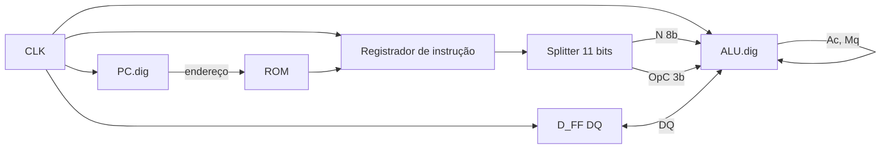

# CPU 8 bits (Digital)

Este repositório contém circuitos do simulador **Digital** ([Digital](https://github.com/hneemann/Digital)): um processador de **8 bits** descrito hierarquicamente em três arquivos `.dig`.

| Arquivo   | Função |
|-----------|--------|
| `cpu.dig` | **CPU de alto nível**: integra memória de instrução, registrador de instrução, contador de programa, um flip-flop auxiliar e a ULA. |
| `PC.dig`  | **Contador de programa (Program Counter)**: endereço da próxima instrução na ROM. |
| `ALU.dig` | **Unidade lógica e aritmética**: opera sobre acumulador, registrador auxiliar e operando `N`, com seleção por `Op` (3 bits). |

---

## Visão geral do `cpu.dig` (foco principal)

O `cpu.dig` é o **diagrama principal**: ele não redefine a lógica da ULA nem do PC; ele **instancia** `PC.dig` e `ALU.dig` e conecta o **fluxo de instruções** à **memória somente leitura (ROM)**.

### Sinais de entrada e saída

- **Entrada**
  - **CLK**: relógio global. Todos os registradores e o flip-flop `D_FF` avançam no mesmo ritmo (conforme como o Digital interpreta as bordas nos subcircuitos).

- **Saídas**
  - **Ac** e **Mq**: valores de **8 bits** vindos da ULA (acumulador e registrador MQ, no estilo de máquinas clássicas com par acumulador/multiplicador).

### Blocos internos e papéis

1. **`PC.dig` (Program Counter)**  
   Fornece o endereço **Q** (8 bits) que aponta para a **ROM** de instruções. Esse endereço é o “onde estou no programa”.

2. **ROM (8 bits de dados)**  
   Na posição indicada pelo PC, a ROM entrega uma palavra de instrução. No esquema, o fluxo segue para um **registrador de instrução** (8 bits no diagrama), que armazena o valor “buscado” naquele ciclo.

3. **Splitter 11 → 8 + 3**  
   A saída do registrador é interpretada como **11 bits**, separados em:
   - **N** (8 bits): operando imediato ou campo numérico usado pela ULA.
   - **OpC** (3 bits): código de operação enviado à ULA (seleção de operação, alinhado ao seletor de 3 bits da `ALU.dig`).

4. **`D_FF` (flip-flop D)**  
   Um **único bit** de estado **DQ** (entrada) / **Q** (saída), ligado ao barramento de controle da ULA. Em CPUs minimalistas, um bit extra costuma guardar **estado de sequência** (por exemplo, etapa de uma operação mais longa ou um sinal derivado do fluxo). O papel exato depende do programa carregado na ROM e de como você mapeia `OpC` e `DQ` nas operações.

5. **`ALU.dig`**  
   Executa a operação escolhida por **OpC**, usando **N**, os registradores internos **Ac** / **Mq** (realimentados pelas saídas) e **DQ**.

### Fluxo de dados (resumo)

Em uma frase: **o PC endereça a ROM; a palavra lida vira `N` e `OpC`; a ULA combina isso com Ac, Mq e o bit DQ; as saídas Ac e Mq fecham o laço de dados.**

### Observações práticas

- O arquivo **não inclui** o conteúdo programado da ROM no XML: no Digital, você define ou importa a **tabela da ROM** na interface (hex/binário), de acordo com o seu conjunto de instruções.
- Há um **splitter 11 → 8 + 3** ligado ao registrador de instrução enquanto a ROM está como **8 bits** no XML: no Digital, confira no esquema se a palavra é estendida com zeros nos bits altos ou se você ajustou ROM/registrador para **11 bits** — o importante é que **N** e **OpC** cheguem coerentes à ULA.
- A **unidade de controle** (máquina de estados explícita, sinais de escrita no PC, etc.) pode estar **implícita** em como `EN` do PC e da ULA são ligados no diagrama completo; neste `cpu.dig`, as conexões visíveis concentram-se no **caminho de dados** e no **relógio** comum.

---

## `PC.dig` — Contador de programa

- **Entradas**: `CLK`, `EN` (habilita atualização do registrador).
- **Saída**: `ADDR` (8 bits), o endereço atual.
- **Lógica**: um **registrador 8 bits** somado a uma constante (blocos `Const` — no desenho há referência a incremento em relação ao valor atual) para formar o **próximo** endereço; quando `EN` está ativo, o novo valor é carregado no registrador na borda de relógio.

Em termos de execução sequencial: a cada instrução habilitada, o PC tende a **avançar para o endereço seguinte**, típico de `PC ← PC + 1` (detalhes numéricos dependem dos valores das constantes no seu arquivo no simulador).

---

## `ALU.dig` — Unidade lógica e aritmética

- **Entradas**
  - **N** (8 bits): segundo operando (vindo do campo da instrução no `cpu.dig`).
  - **Ac** / **Mq** (8 bits cada): realimentação dos registradores da própria ULA (saídas registradas).
  - **Op** (3 bits): seleciona uma entre **8 operações** nos multiplexadores.
  - **EN**, **Clk**: habilitam e sincronizam a escrita nos registradores de saída.

- **Operações previstas no diagrama** (via blocos dedicados e MUX 8:1):
  - Aritmética: **soma**, **subtração**, **multiplicação** (produto 16 bits repartido em parte baixa/alta), **divisão** (quociente `Q` e resto `R`).
  - Deslocamentos: **Barrel shifter** à esquerda e à direita (com constantes de quantidade de bits nos `Const` ligados aos shifters).
  - Lógica: **NAND** e **XOR** em largura 8 bits.

- **Saídas**: **AC** e **MQ** (rótulos no painel da ULA), que no `cpu.dig` aparecem como **Ac** e **Mq** para o restante do processador.

O **campo `Op` de 3 bits** na ULA corresponde naturalmente ao **`OpC`** de 3 bits produzido pelo splitter no `cpu.dig`, desde que a ordem das entradas do multiplexador coincida com a codificação das instruções na ROM.

---

## Ferramentas e dependências

- **Digital** (Java): abra `cpu.dig` como circuito principal; os subcircuitos `PC.dig` e `ALU.dig` devem estar no mesmo diretório ou no caminho de biblioteca do projeto.

---

## Roteiro de vídeo (explicação do projeto)

**Duração sugerida:** 12–18 minutos (ajuste cortando ou aprofundando o “demo ao vivo”).

### 1. Abertura (30 s – 1 min)

- Apresentar o tema: “CPU 8 bits montada no simulador Digital, com três arquivos: CPU, PC e ULA.”
- Mostrar rapidamente os três arquivos no explorador e abrir **`cpu.dig`** primeiro.

### 2. O que é o `cpu.dig` (3–5 min) — **prioridade**

- Explicar que é o **nível superior**: “aqui não redesenhamos a ULA; a gente **conecta** o contador de programa, a ROM e a ULA.”
- No diagrama, seguir o **fluxo da instrução**:
  1. **PC** → endereço na **ROM**.
  2. Dado lido → **registrador de instrução**.
  3. Palavra de **11 bits** → **splitter** → **N** (8) + **OpC** (3).
  4. **OpC** vai para a ULA; **N** é o operando; **Ac** e **Mq** voltam da ULA.
  5. Mencionar o **flip-flop `D_FF`** e o sinal **DQ** como “bit extra de estado” ligado à ULA (sem entrar em suposições não verificáveis: deixar claro que o significado depende da ROM e do mapeamento de instruções).
- Reforçar: **CLK** é o **mesmo tempo** para PC, registrador de instrução, flip-flop e ULA — visão de “caminho de dados” síncrono.

### 3. Papel do `PC.dig` (2–3 min)

- Abrir `PC.dig` em outra aba ou zoom.
- Explicar **ADDR**, **EN**, **CLK** e a ideia de **incremento** do endereço.
- Voltar ao `cpu.dig` e mostrar **onde** o endereço do PC alimenta a ROM (fechar o ciclo “próxima instrução”).

### 4. Papel do `ALU.dig` (3–5 min)

- Abrir `ALU.dig`.
- Mostrar a **árvore de operadores** (soma, sub, mul, div, shifts, NAND, XOR) e os **dois multiplexadores 8:1** guiados por **Op** (3 bits).
- Relacionar com o **`cpu.dig`**: “esses 3 bits são o **OpC** que veio do splitter.”
- Mostrar os **dois registradores** e as saídas **AC/MQ** que voltam para o chip da CPU.

### 5. Demonstração no simulador (2–4 min)

- Rodar o clock manual ou automático (modo que o Digital oferecer).
- Se a ROM estiver preenchida: apontar **PC**, **instrução na saída da ROM**, **N** e **OpC**, e **Ac/Mq** mudando.
- Se a ROM estiver vazia: explicar que é preciso **programar a ROM** para ver comportamento útil — e que o “conjunto de instruções” é uma decisão de projeto sua.

### 6. Encerramento (30 s – 1 min)

- Resumir: **`cpu.dig`** integra tudo; **`PC.dig`** endereça instruções; **`ALU.dig`** executa as operações.
- Convite objetivo: “no próximo vídeo podemos definir a tabela de opcodes e um programa de teste na ROM” (opcional, só se quiser continuar a série).

---

## Licença e créditos

Inclua aqui a licença do repositório, se houver. O simulador Digital possui licença própria; consulte o repositório oficial do projeto.
